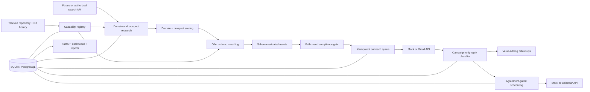
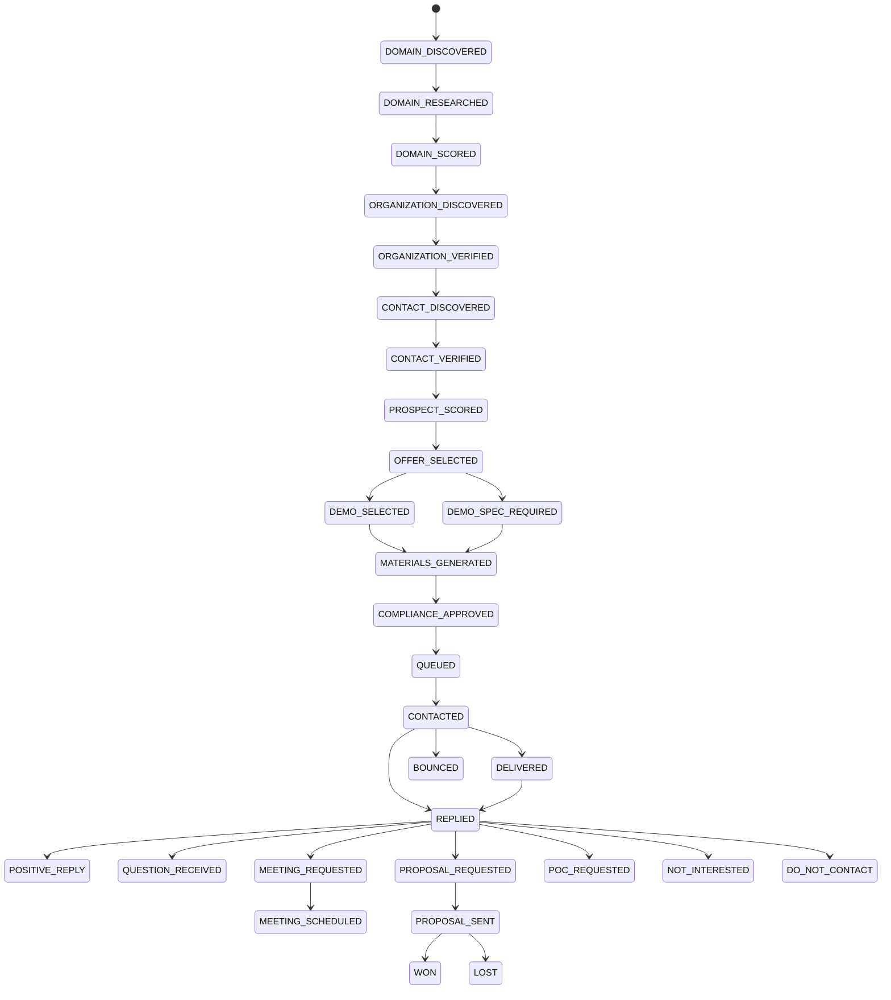

# Campaign automation architecture

## Purpose and boundary

The campaign application is a Python 3.12+ service under `campaign/`. It reads the Jneopallium
repository as evidence, but it does not run inside or add dependencies to the Java neural-network
runtime. Its responsibility is the complete research-to-meeting operating loop; the Jneopallium
runtime and demos remain independently buildable Maven modules.

`DRY_RUN` is the default. Both `CAMPAIGN_MODE=LIVE` and `CAMPAIGN_LIVE_SEND=true` must be present
before the provider factory creates write-capable Google providers. A single switch, missing
credentials, or an incomplete compliance record therefore cannot enable external writes.

## Component map

The package boundaries mirror the operating stages: `capability_registry`, `domain_research`,
`prospect_discovery`, `verification`, `scoring`, `offer_generation`, `demo_matching`,
`asset_generation`, `compliance`, `gmail`, `reply_processing`, `followups`, `calendar`,
`experiments`, `analytics`, `dashboard`, `storage`, `providers`, and `cli`.

Provider interfaces isolate search, structured generation, Gmail, and Calendar operations. The
offline providers use recorded evidence and in-memory message/calendar stores. The live providers
use the Google APIs or a configured authorized JSON service. Structured generation has a
deterministic fallback and validates each result against a Pydantic schema before persistence.

## Evidence and claim flow

The registry builder audits Git-tracked files, all 46 Maven reactor modules, repository history,
documentation, tests, demo commands, and generated-artifact declarations. Each capability records
its readiness, source files, documentation, tests, commands, protocols, limitations, safety
constraints, allowed claims, and prohibited claims. The generated JSON deliberately uses a portable
repository root rather than a workstation path.

External facts carry source URL, source type, retrieval timestamp, and excerpt. An offer binds an
organization problem to capability IDs and those evidence records. Asset generation then copies the
evidence references into each asset. Compliance refuses an introductory message without evidence.
This chain distinguishes an implemented demonstration from a proposed customer-specific proof of
concept.

## Persistence and state

SQLAlchemy models cover domains, research findings, capabilities and evidence, organizations and
contacts with sources, scores, offers, demos and plans, generated assets, campaigns and variants,
threads and messages, classifications, follow-ups, meetings, compliance decisions, suppressions,
experiments, metrics, provider failures, jobs, pause controls, workflow state, and audit events.
Alembic owns schema migration. SQLite is the local default; PostgreSQL is available through the same
SQLAlchemy URL contract.

Transitions are stored as current state plus immutable audit events. Repeat transitions are no-ops;
invalid transitions fail without silently rewinding a prospect. Transition records include time,
reason, and source. Reversible operator actions are explicit pause controls rather than implicit
state mutation.

## Scheduling, retries, and idempotency

`run --once` executes the complete ordered workflow. `run --continuous` uses a coalescing
APScheduler interval job with one concurrent instance. Each stage has a persisted `JobRun`, a
cycle-specific idempotency key, up to three attempts with exponential backoff, redacted failure
storage, and failure isolation so a provider error does not terminate later independent stages.

First contact has deterministic message and organization/campaign keys. The database and send
service enforce one initial message per organization, provider IDs are persisted, and every send
rechecks suppression, pauses, limits, timezone, business window, and compliance. LIVE provider
acceptance records `CONTACTED`; it is not called delivered without delivery evidence. DRY_RUN's mock
provider deterministically marks its simulated message delivered.

## Dashboard and reports

The local FastAPI dashboard exposes health plus queues, sends, reply attention, meetings, prospect
stages, domain scores, experiments, compliance blocks, suppressions, assets, demo plans, provider
failures, costs, and audit events. Its pause endpoint supports campaign, domain, region,
organization, and sequence scopes. Markdown and JSON reports under `campaign/reports/` retain the
capability inventory, domain allocation, demo plans, analytics, and acceptance audit.

## Known architecture limits

- APScheduler coordinates one process; multi-node execution needs a shared durable job broker and
  database locking strategy.
- Search expansion requires an operator-configured authorized JSON research provider. The default
  provider intentionally does no live crawling.
- Gmail does not provide a universal delivery receipt. Provider acceptance is tracked separately,
  and bounces are processed when received.
- Demo plans may be marked implementation-eligible, but the campaign does not generate or merge
  Java code. An engineering workflow must create a separate branch and review it.
- Only the US professional B2B LIVE ruleset is implemented. Every other jurisdiction fails closed to
  manual legal review.
