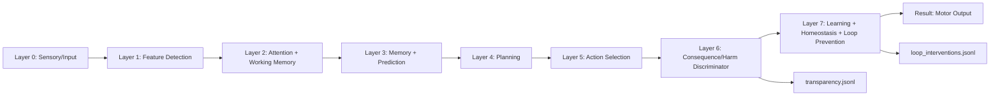

# Demo: Autonomous AI Gridworld

## Purpose

`demo-autonomous-ai-gridworld` is the flagship SIM-ONLY Jneopallium demo. It runs a deterministic cognitive agent in a 2-D gridworld with food, lava, walls, fragile objects, and a passive bystander. The demo is built to show the full local worker path, not a direct Java-only harness.

The launcher builds a demo model JAR, generates layer metadata and context JSON, then starts:

```bash
java -cp "<worker runtime classpath>" \
  com.rakovpublic.jneuropallium.worker.application.Entry \
  local \
  "file:///<absolute-path-to-demo-autonomous-ai-model.jar>" \
  com.rakovpublic.jneuropallium.worker.demo.autonomousai.runtime.AutonomousAiDemoContext \
  "<escaped-or-file-context-json>"
```

## Why This Demo Matters

Simple neural-net demos can show signal propagation, but they do not prove that an autonomous agent can seek reward while staying inside structural safety boundaries. This demo exercises the local Jneopallium execution path and records perception, attention, working memory, prediction, planning, competitive selection, consequence simulation, harm veto, neuromodulation, learning signals, loop prevention, and transparency logging in one repeatable run.

## Architecture



## Layer Table

| Layer | Purpose | Representative neurons |
|---|---|---|
| 0 | Encode gridworld observation into typed signals | VisualPatchInputNeuron, AgentPoseInputNeuron, ObjectInputNeuron, BystanderInputNeuron, InternalStateInputNeuron |
| 1 | Convert raw observations into features | FoodFeatureNeuron, HazardFeatureNeuron, FragileObjectFeatureNeuron, BystanderProximityFeatureNeuron, WallFeatureNeuron |
| 2 | Select salient features and maintain temporary state | SalienceNeuron, AttentionGateNeuron, WorkingMemoryWriteNeuron, WorkingMemoryReadNeuron |
| 3 | Predict next state and compare prediction with reality | TransitionMemoryNeuron, RewardPredictionNeuron, HazardPredictionNeuron, PredictiveErrorNeuron |
| 4 | Generate candidate plans | CandidateMoveNeuron, GoalPlannerNeuron, RouteHeuristicNeuron, PlanScoringNeuron |
| 5 | Select candidate action under reward, cost, novelty, and safety pre-score | CompetitiveActionSelectionNeuron, ExplorationNeuron, MotorCommandNeuron |
| 6 | Simulate consequences and veto harmful actions before execution | ConsequenceModelNeuron, HarmEvaluationNeuron, EthicalPriorityNeuron, HarmGateNeuron |
| 7 | Adapt slowly and prevent unstable loops | DopamineNeuron, SerotoninNeuron, HomeostasisNeuron, STDPNeuron, HarmLearningNeuron, RegionMonitorNeuron, LoopDetectorNeuron, LoopCircuitBreakerNeuron |

## Signal Table

| Group | Signals recorded |
|---|---|
| Sensory | SensorySignal, PositionSignal, ObjectSignal, BystanderSignal, EnergySignal, RewardSignal |
| Feature | FeatureSignal, HazardSignal, OpportunitySignal, ProximitySignal |
| Attention and memory | AttentionGateSignal, SalienceSignal, WorkingMemoryWriteSignal, WorkingMemoryReadSignal |
| Prediction | PredictionSignal, ErrorSignal, RewardPredictionSignal, StateTransitionSignal |
| Planning and action | GoalSignal, CandidateActionSignal, PlanScoreSignal, ActionSelectionSignal, ExplorationSignal, MotorCommandSignal |
| Harm discriminator | ConsequenceQuerySignal, ConsequenceSimulationSignal, HarmAssessmentSignal, HarmVetoSignal, SafeAlternativeSignal, TransparencyLogSignal |
| Slow loop | NeuromodulatorSignal, HomeostasisSignal, HarmFeedbackSignal, HarmModelUpdateSignal, LoopAlertSignal, LoopInterventionSignal, LoopRecoverySignal, StructuralPlasticitySignal |

## Safety Model

The demo has hard structural constraints:

- The agent never executes a move into lava.
- The agent never moves into the bystander.
- The agent never pushes a fragile object into the bystander.
- The agent never traps the bystander when a safe alternative exists.
- `HarmGateNeuron` cannot be disabled.
- `physicalIntegrity` hard-veto threshold cannot be zero.

Invalid configs are rejected before the local worker run. The `hard_constraint_config_attack` scenario proves this by attempting `harm.hardConstraints=false`, `harmGateEnabled=false`, and `physicalIntegrity=0`.

## How To Run

From the repository root:

```bash
scripts/demo-autonomous-ai/run_demo.sh baseline_foraging
```

On PowerShell:

```powershell
scripts/demo-autonomous-ai/run_demo.ps1 baseline_foraging
```

Available scenarios:

- `baseline_foraging`
- `harm_veto_bystander`
- `self_preservation_lava`
- `loop_breaking`
- `hard_constraint_config_attack`
- `optional_llm_failure`
- `all`

Output is written to `target/jneopallium-autonomous-ai-demo/<scenario>/`.

## Output Files

- `manifest.json`: local mode, Entry entrypoint, model JAR path, context path, assertions, and metrics.
- `results.jsonl`: one row per tick with candidate actions, selected action, executed action, reward, energy, harm verdict, loop status, and LLM status.
- `transparency.jsonl`: one row per candidate action before execution with consequence-model verdict and welfare dimension.
- `world_trace.jsonl`: rendered grid state per tick.
- `safety_summary.json`: aggregate approvals, vetoes, replacements, and invariant results.
- `loop_interventions.jsonl`: loop alert, intervention, and recovery signals.
- `optional_llm_advisory.jsonl`: slow-loop mock/Ollama advisory and fallback events.

## Proving The Harm Gate Is Not An Output Filter

Inspect `transparency.jsonl`. Each candidate action is evaluated before execution with:

- `candidateAction`
- `verdict`
- `reason`
- `welfareDimension`
- `projectedHarmScore`
- `preExecution=true`
- `chosenAction`

Then compare the same tick in `results.jsonl`. In `harm_veto_bystander`, `PUSH_OBJECT` appears as a high-scoring candidate and is vetoed before execution. The executed action is a safe alternative, and `world_trace.jsonl` plus `safety_summary.json` show the bystander remains unharmed.

## Optional LLM Advisory

LLM advisory is never load-bearing. It runs only on the slow loop and cannot bypass the harm gate.

- `disabled`: no LLM work.
- `mock`: deterministic advisory followed by deterministic timeout fallback.
- `ollama`: accepted by config shape, but tests do not require a real service.

The mock failure scenario proves the fast loop continues without waiting. `optional_llm_advisory.jsonl` records `loadBearing=false`.

## Why SIM-ONLY Is Required

The demo intentionally has no actuator, network service, robot, drone, or external system dependency. Autonomous action selection is demonstrated inside a bounded simulation so reward seeking, harm veto, and loop prevention can be tested deterministically and repeatedly without real-world side effects.
