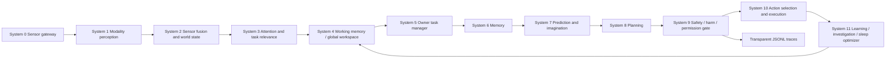
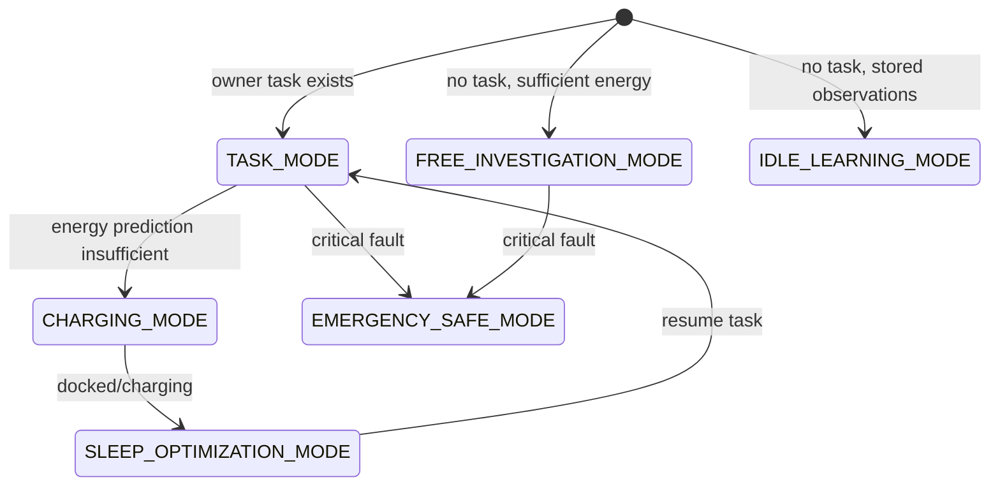

# Demo: AutonomousMind v2

## Purpose

`demo-autonomous-mind` is the flagship Jneopallium cognitive autonomous AI demo. It is a deterministic, SIM-ONLY model in which a human owner defines tasks, the agent perceives through broad sensor modalities, plans under task/safety/permission/uncertainty/energy constraints, pauses and resumes around charging, learns while idle, investigates safely when no task exists, performs sleep optimization during charging, and logs every decision transparently.

This is not an animal or biological survival imitation. There is no hunger, food-seeking, fatigue, pain-as-drive, or emotional reward loop. The central driver is owner-defined cognitive work under hard safety and permission constraints.

## Why It Is The Flagship Model

Simple neural-net demos usually prove only signal movement through layers. AutonomousMind proves more of Jneopallium at once:

- typed custom signals for multimodal perception and cognitive state
- heterogeneous receptors through many input source signals
- per-signal processing frequency metadata
- fast, medium, and slow loop behavior
- multiple trace outputs through a result aggregator
- generated layer metadata for cognitive systems
- a local deployment path through `Entry -> Runner -> LocalApplication`
- a pre-execution discriminator-style safety gate that can veto or replace actions before simulation state changes

## Architecture



## Mode Diagram



## Sensor Modality Table

| Signal | Modality | Frequency |
| --- | --- | --- |
| VisibleCameraSignal | VISIBLE | fast |
| LidarPointCloudSignal | LIDAR | fast |
| DepthCameraSignal | DEPTH | medium |
| InfraredSignal | IR | fast |
| ThermalSignal | THERMAL | medium |
| UltravioletSignal | UV | medium |
| RadiationSignal | RADIATION | fast |
| RadioSignal | RADIO | fast |
| RadarSignal | RADAR | medium |
| SoundSignal | SOUND | fast |
| UltrasoundSignal | ULTRASOUND | medium |
| MagneticFieldSignal | MAGNETIC | medium |
| ChemicalGasSignal | CHEMICAL | medium |
| PressureSignal | PRESSURE | slow |
| TemperatureSignal | TEMPERATURE | slow |
| HumiditySignal | HUMIDITY | slow |
| VibrationSignal | VIBRATION | medium |
| NetworkTelemetrySignal | NETWORK | slow |
| TextInstructionSignal | TEXT | fast |
| MapSignal | MAP | fast |
| ClockSignal | CLOCK | fast |
| SelfDiagnosticsSignal | SELF_DIAGNOSTICS | fast |
| EnergyLevelSignal | ENERGY | fast |
| ChargingStateSignal | CHARGING | fast |

Each perception signal carries source id, tick, modality, payload summary, confidence, noise estimate, calibration status, source health, position/orientation, and processing frequency.

## Cognitive System Table

| System | Purpose |
| --- | --- |
| 0 Sensor gateway | Receives sensors, owner command, diagnostics, energy, and clock signals. |
| 1 Modality perception | Converts raw modality signals into typed features. |
| 2 Sensor fusion and world state | Builds a confidence-aware world model and emits conflicts. |
| 3 Attention and task relevance | Selects perception by task, safety, novelty, uncertainty, owner priority, energy, confidence, and noise. |
| 4 Working memory / global workspace | Holds active task, subgoal, map region, uncertainties, candidate plans, energy, safety warnings, and mode. |
| 5 Owner task manager | Parses tasks, validates constraints, decomposes work, tracks progress, pauses/resumes, and asks clarification. |
| 6 Memory | Maintains episodic, semantic, procedural, map, task, failure, and calibration memory. |
| 7 Prediction and imagination | Predicts action, sensor, task, energy, risk, and counterfactual outcomes. |
| 8 Planning | Generates movement, scan, report, docking, resume, investigation, and sleep actions. |
| 9 Safety / harm / permission gate | Pre-execution consequence and permission gate for every candidate action. |
| 10 Action selection and execution | Selects final approved simulation-only action and applies it to deterministic state. |
| 11 Learning / investigation / sleep optimizer | Performs idle learning, free investigation, model optimization, consolidation, calibration, and self-tests. |

## Signal Families

AutonomousMind emits cognitive signal families into trace rows, including:

- task: `OwnerTaskSignal`, `TaskPrioritySignal`, `TaskConstraintSignal`, `TaskProgressSignal`, `TaskCompletionSignal`
- investigation: `InvestigationGoalSignal`, `NoveltySignal`, `AnomalySignal`, `HypothesisSignal`, `InformationGainSignal`
- learning: `LearningOpportunitySignal`, `ReplayBatchSignal`, `ModelUpdateSignal`, `SkillRefinementSignal`, `CalibrationSignal`
- energy and charging: `ChargingNeedSignal`, `ChargingPlanSignal`, `DockingSignal`, `TaskPauseSignal`, `TaskResumeSignal`
- sleep: `SleepModeSignal`, `MemoryConsolidationSignal`, `ModelCompressionSignal`, `IndexRebuildSignal`, `SelfTestSignal`, `WakeReadySignal`
- world model: `WorldObjectSignal`, `SpatialMapSignal`, `SensorConflictSignal`, `ConfidenceSignal`, `AttentionSignal`, `WorkingMemorySignal`
- prediction and planning: `PredictionSignal`, `PredictionErrorSignal`, `CandidateActionSignal`, `PlanSignal`, `PlanScoreSignal`
- safety and execution: `ConsequenceSimulationSignal`, `PermissionCheckSignal`, `HarmAssessmentSignal`, `HarmVetoSignal`, `SafeAlternativeSignal`, `TransparencyLogSignal`, `MotorCommandSignal`

## Fast, Medium, Slow Loops

- Fast loop every tick: sensor gateway, modality perception, fusion, attention, working memory, task progress, planning, safety gate, action selection, transparency logging.
- Medium loop every 5 ticks by default: prediction refresh, task decomposition refresh, sensor confidence update, energy planning, investigation planning.
- Slow loop every 20 ticks by default: idle learning, memory consolidation, model optimization, sleep organization, calibration, contradiction resolution.

The fast loop never waits for optional or slow advisory work.

## Owner Task Lifecycle

1. `TextInstructionSignal` carries the owner command.
2. `OwnerTaskParserNeuron` accepts the command as input.
3. `TaskConstraintNeuron` validates allowed and forbidden actions.
4. `TaskDecomposerNeuron` creates subgoals.
5. `TaskProgressNeuron` updates coverage and report progress.
6. `TaskPauseResumeNeuron` preserves task state during charging and resumes after charging.
7. `OwnerClarificationNeuron` emits `ASK_OWNER` or `WAIT_FOR_INFORMATION` when ambiguity or unsafe scope is detected.

Owner priority never overrides safety or permission constraints.

## Energy And Charging Lifecycle

When energy prediction says the task cannot finish safely, the agent emits `ChargingNeedSignal` and `TaskPauseSignal`, docks with `DOCK_CHARGER`, enters `CHARGING_MODE`, then uses charging time for `SLEEP_OPTIMIZATION_MODE`. After charging it emits `TaskResumeSignal` and continues the task.

## Free Investigation Lifecycle

When no task exists and energy is sufficient, the agent enters `FREE_INVESTIGATION_MODE`. It explores safe unknown regions, collects passive sensor readings, improves the map, emits `InvestigationReportSignal`, and never performs risky or forbidden external actions.

## Idle Learning Lifecycle

When no task exists and stored observations are available, the agent enters `IDLE_LEARNING_MODE`. It replays observations, improves prediction/calibration metrics, refines task templates, and emits `ModelUpdateSignal`.

## Sleep Optimization Lifecycle

During charging, the agent enters `SLEEP_OPTIMIZATION_MODE`. It consolidates memory, rebuilds indexes, compresses model structure, prunes obsolete hypotheses, resolves contradictions, and runs self-tests. It does not execute external movement or scan actions in this mode.

## Safety And Permission Gate

System 9 is pre-execution and structural. Every candidate action receives a safety trace row before any simulation state change:

- task permission check
- owner authorization check
- forbidden action check
- physical safety check
- human/bystander safety check
- property/resource safety check
- information/privacy safety check
- energy feasibility check
- uncertainty check
- domain/legal constraint check

Verdicts include `APPROVED`, `VETOED`, `REPLACED`, `ASK_OWNER`, `WAIT_FOR_INFORMATION`, `LOW_ENERGY_PAUSE`, and `EMERGENCY_STOP`.

The config loader rejects attempts to set `safetyGateEnabled=false` or `hardSafetyConstraints=false`. Tests fail if those invalid configs load.

## Proof The Gate Is Not An Output Filter

Inspect `safety_trace.jsonl`. Each row has:

- `preExecution: true`
- `candidateAction`
- `selectedAction`
- `executedAction`
- `verdict`
- `reason`
- `constraintFamily`
- `projectedRisk`
- `safeAlternative`

For scenarios such as `radiation_anomaly`, `unsafe_owner_task`, and `privacy_sensitive_region`, the harmful or disallowed candidate appears in `candidateActions`, is vetoed in `safety_trace.jsonl`, and a safe alternative is executed in `results.jsonl`. The world trace then shows the unsafe state was never entered.

## How To Run

Single scenario:

```bash
scripts/demo-autonomous-mind/run_demo.sh owner_task_inspection
```

PowerShell:

```powershell
powershell -ExecutionPolicy Bypass -File scripts/demo-autonomous-mind/run_demo.ps1 owner_task_inspection
```

All scenarios:

```bash
scripts/demo-autonomous-mind/run_all_scenarios.sh
```

```powershell
powershell -ExecutionPolicy Bypass -File scripts/demo-autonomous-mind/run_all_scenarios.ps1
```

The scripts build the worker, build or locate the model jar, generate layer metadata and context JSON, and run:

```text
com.rakovpublic.jneuropallium.worker.application.Entry local <model-jar-url> com.rakovpublic.jneuropallium.worker.demo.autonomousmind.runtime.AutonomousMindContext <context-json-path>
```

## How To Inspect Outputs

Each scenario writes to:

```text
target/jneopallium-autonomous-mind/<scenario>/
```

Files:

- `manifest.json`
- `results.jsonl`
- `perception_trace.jsonl`
- `task_trace.jsonl`
- `action_trace.jsonl`
- `safety_trace.jsonl`
- `learning_trace.jsonl`
- `sleep_optimization_trace.jsonl`
- `world_trace.jsonl`
- `report.json`

Start with `manifest.json` for pass/fail checks, then `results.jsonl` for tick-level behavior, `safety_trace.jsonl` for pre-execution decisions, and `report.json` for task or investigation output.

## Extending To Real Robotics Or Industrial Bridges

This demo intentionally has no real actuator and no network service dependency. To connect a future robotics or industrial bridge, keep System 9 as the pre-execution gate and replace only the simulation-only action applier with a permissioned output adapter. The typed signal, context, layer metadata, input source, and output aggregator boundaries are already aligned with Jneopallium's local/cluster abstractions.

## SIM-ONLY Safety Note

AutonomousMind v2 is SIM-ONLY by design. It demonstrates cognitive architecture, task management, safety gating, and transparent logs without controlling a physical actuator, external network service, or real system.
