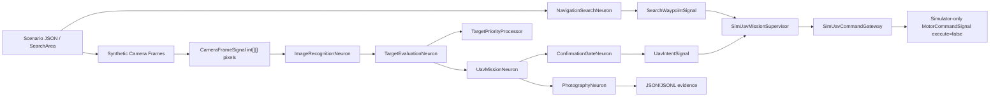

# Demo: Simulation-Only Single UAV

## Purpose

`demo-uav-single` is a deterministic, simulation-only UAV reconnaissance and inspection demo. It models one UAV that searches a specified area, recognizes observation targets from simulated camera pixel matrices, scores candidate priorities, approaches only to a configured safe photography distance, records simulated photograph metadata, and returns home.

The demo has two modes:

- `FULLY_AUTONOMOUS`: cover the search area, recognize targets from image pixels, select, approach, photograph, and return home inside the simulator boundary.
- `TARGET_CONFIRM`: cover the search area and prioritize recognized targets autonomously, then hold until a valid human confirmation authorizes target-specific observation or photography.

No external Gazebo, ROS 2, MAVLink, network, or SITL process is required for tests.

## Architecture



Main package:

```text
worker/src/main/java/com/rakovpublic/jneuropallium/worker/demo/uavsingle/
```

The boundary for any simulator movement is:

```text
Jneopallium -> UavIntentSignal -> SimUavMissionSupervisor -> simulator adapter
```

The gateway emits `MotorCommandSignal` only with `execute=false`, records `bridgeSafetyMode=SIMULATOR_ONLY`, and writes a supervisor audit row before any simulated command is considered accepted.

## Search And Recognition

`SearchArea` defines a rectangular search sector with altitude, grid spacing, and detection radius. `SearchCoverageNeuron` produces a deterministic serpentine grid, `NavigationSearchNeuron` emits `SearchWaypointSignal`, and every waypoint is validated by `SimUavMissionSupervisor` as `SEARCH_ROUTE`.

Targets are not handed directly to target evaluation. The simulator generates `CameraFrameSignal` values with an `int[][] pixels` matrix. `ImageRecognitionNeuron` now runs a Jneopallium-style convolutional recognizer instead of exact pixel matching:

- `PixelPatchSignal` carries each normalized 3x3 pixel window.
- `ConvolutionalPerceptronNeuron` consumes exactly nine values per firing and emits `ConvolutionFeatureSignal`.
- The first feature layer scans pixel patches for edges, center-surround energy, and bright mass.
- `FeaturePatchSignal` carries 3x3 windows of first-layer activations into a second feature layer.
- `PooledFeatureSignal` and `FeatureVectorSignal` summarize the feature maps.
- `ClassificationNeuron` emits `ClassificationScoreSignal` values and selects the target class from pooled features.

Class templates are used only to initialize deterministic feature prototypes for tests and replay. Runtime recognition compares learned-style feature vectors, so noisy non-exact pixel matrices can still classify correctly. The result records image features, feature-layer signal counts, classifier scores, and a pixel hash before emitting `RecognitionResultSignal`. Only recognized observations become `ObservationTarget` candidates for priority scoring.

## Safety Boundary

The mission supervisor validates every high-level intent:

- `simulatorOnly` is true.
- vehicle system ID is allowlisted.
- Jneopallium and autopilot heartbeats are healthy.
- command is not expired.
- mission ID matches.
- destination is inside the geofence.
- destination is outside no-go zones.
- altitude and speed are within limits.
- battery reserve and localization quality are sufficient.
- operator override and harm veto are not active.

Rejected intents enter `SAFETY_HOLD` and then return home.

## State Machine

```text
INITIALIZING
PREFLIGHT_CHECK
TAKEOFF_REQUESTED
SEARCHING
TARGET_CANDIDATE_FOUND
TARGET_EVALUATION
TARGET_SELECTED
```

In `FULLY_AUTONOMOUS`:

```text
APPROACHING_SAFE_OBSERVATION_POINT
OBSERVING
PHOTOGRAPHING
VERIFYING_PHOTO
RETURNING_HOME
LANDED
COMPLETED
```

In `TARGET_CONFIRM`:

```text
HOLDING_FOR_CONFIRMATION
CONFIRMED | DENIED | CONFIRMATION_TIMEOUT
```

Only a valid `CONFIRMED` path can continue to observation and photography. Illegal transitions throw immediately.

## Target Priority

Each target writes factors and score to `transparency.jsonl`:

```text
priority =
    0.25 * missionRelevance
  + 0.20 * confidence
  + 0.15 * urgency
  + 0.10 * informationValue
  + 0.10 * proximityBenefit
  + 0.10 * routeEfficiency
  + 0.10 * communicationValue
  - 0.20 * safetyRisk
  - 0.15 * energyCost
  - 0.10 * duplicationPenalty
```

The final score is clamped to `[0, 1]`. Ties are deterministic by target ID.

## Confirmation Protocol

`TARGET_CONFIRM` requests bind confirmation to:

- target ID
- request ID
- mission ID
- UAV ID
- action
- expiry tick

Scenario files support `APPROVE`, `DENY`, `TIMEOUT`, `APPROVE_TOO_LATE`, `WRONG_TARGET`, and `WRONG_REQUEST_ID`. Stale, duplicate, mismatched, or denied confirmations do not authorize target-specific action.

## Scenarios

- `autonomous_success`
- `autonomous_priority_change`
- `confirm_approved`
- `confirm_denied`
- `confirm_timeout`
- `low_battery_rth`
- `geofence_veto`
- `lost_heartbeat`
- `poor_visibility`
- `duplicate_confirmation`
- `all`

## How To Run

From the repository root:

```bash
scripts/demo-uav-single/run_demo.sh all
```

On PowerShell:

```powershell
scripts/demo-uav-single/run_demo.ps1 all
```

The scripts build the project, run `UavSingle*Test`, execute the selected scenario set, validate generated artifacts, and print a CSV pass/fail table.

## Output Files

Artifacts are written under:

```text
target/jneopallium-uav-single/<scenario>/
```

Files:

- `manifest.json`
- `summary.json`
- `mission-events.jsonl`
- `search-events.jsonl`
- `target-events.jsonl`
- `recognition-events.jsonl`
- `confirmation-events.jsonl`
- `photograph-events.jsonl`
- `supervisor-audit.jsonl`
- `transparency.jsonl`
- `safety-summary.json`

`summary.json` also reports `searchAreaId`, `searchWaypointsPlanned`, `searchWaypointsVisited`, `cameraFramesProcessed`, and `recognitionsProduced` so the run can prove that target candidates came from autonomous search and image recognition.

## Simulator Integration

The default run is an in-memory deterministic simulator. `UavSingleConfig` includes MAVLink and ROS 2 endpoint fields, vehicle allowlists, geofence, no-go zones, altitude/speed limits, battery reserve, confirmation timeout, retry limit, and priority weights.

A later ArduPilot SITL or Gazebo adapter can replace `SimUavCommandGateway` while preserving the same `UavIntentSignal` and `SimUavMissionSupervisor` boundary. The first production-facing adapter should keep `SIMULATOR_ONLY`, vehicle allowlists, operator confirmation, and audit output enabled.

## Known Limitations

- The default camera is metadata-only and deterministic.
- MAVLink and ROS 2 endpoint fields are configuration surfaces, not live transports in the unit tests.
- Route validation checks the destination point; a future SITL adapter should add segment-level path checking.
- No live UI is required for confirmation; scenario JSON provides deterministic responses.
